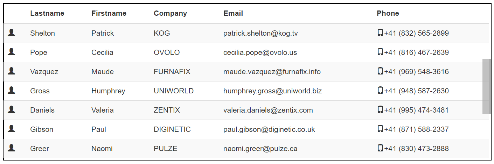

# BOXES-SCROLL : synchronize ng-repeat with scrollbar

[](https://www.npmjs.com/package/boxes-scroll)
[](https://travis-ci.org/hhdevelopment/boxes-scroll)
[](https://github.com/hhdevelopment/boxes-scroll)

## Web site

http://hhdev.fr/boxes-scroll/index.html#

## Overview

boxes-scroll is a collection of directives for angular 1.x

it allows to use angular directive *limitTo* synchronized with a scrollbar.

It is very usefull to use those directives when you want to show many items without impacting performance, burdened by the increase in watchers.

Those directeives limit the number of watchers and improve performance of your application.

More it is really usefull, if you want to scroll in a table but your users want to see the headers fixed.

Set size of your table in pixel on box, or set the maximun items that you want and box-scroll compute pertinent limit and manage begin variable.

## Comparaison

| features/impls    	| box-vscroll                                                                                                                   	| html table with overflow container                                                                                                         	|   
|------------------	|-------------------------------------------------------------------------------------------------------------------------------	|--------------------------------------------------------------------------------------------------------------------------------------------	|   
| watchers         	| ![+][positive] limit watchers about visible rows                                                                              	| ![-][negative] each row increase watchers, visible or not                                                                                  	|   
| faster           	| ![+][positive] ng-repeat draws only visible rows, try demo with 2000 or 10000 item, and check/uncheck 'try without directive' 	| ![-][negative] ng-repeat draws all rows, try demo with 2000 or 10000 item, and check/uncheck 'try without directive'                       	|   
| headers          	| ![+][positive] headers are always visible                                                                                     	| ![-][negative] headers go away when scroll                                                                                                 	|   
| scrollbar        	| ![+][positive] scrollbar is collapsible, scrollbar indicator get only 4px                                                     	| ![-][negative] depends to browsers, but scrollbar get minimum 16px                                                                         	|   
| cells size       	| ![+][positive] cells size depends only of data visible. It's more efficient                                                   	| ![-][negative] cells size depends of data in all rows.    So if one cell contains too large text, all cells in the same column is changed. 	|   
| scroll indicator 	| ![+][positive] has scroll indicator                                                                                           	| ![-][negative] has not                                                                                                                     	|   
| tree structure   	| ![-][negative] Can't be used, cause all nodes are not rendered                                                                	| ![+][positive] Can be used, all nodes are rendered, the tree structure is retained                                                         	|   
|                  	|                                                                                                                               	|                                                                                                                                            	|   

[positive]: assets/plus.png "Positive point"
[negative]: assets/minus.png "Negative point"



---

## Installation

Installation is easy with minimal dependencies - only the AngularJS and Jquery

#### Install with NPM

```sh
$ npm install boxes-scroll
```

### Adding dependency to your project

When you are done downloading all the dependencies and project files the only remaining part is to add dependencies on the `scroll-box` AngularJS module:

```js
require('./node_modules/boxes-scroll/dist/boxesscroll.css');
require('./node_modules/boxes-scroll/dist/boxesscroll.js');
```

```js
angular.module('myModule', ['boxes.scroll']);
```

## Uses

boxes-scroll have two directives

- box-vscroll : it is the most common use. it is a box with vertical scrollbar, synchronized with ng-repeat:   
  for example, on tr in the table with many rows.
- box-hscroll : A box with horizontal scrollbar, synchronized with ng-repeat.


### HTML

Example with bootstrap table

```html
<box-vscroll total="ctrl.items.length" ng-begin="begin" ng-limit="limit"
					style="border:solid 1px black;height:300px">
	<table class="table table-hover table-striped">
		<thead>
			<tr>
				<th></th>
			</tr>
		</thead>
		<tbody>
			<tr ng-repeat="item in ctrl.items| limitTo:limit:begin">
				<td ng-bind="item"></td>
			</tr>
		</tbody>
	</table>
</box-vscroll>
```

```js
(function (ng) {
	'use strict';
	ng.module('app', ['boxes.scroll']).controller('AppCtrl', AppCtrl);
	function AppCtrl() {
		var ctrl = this;
		ctrl.items = [.......];
	}
})(angular);
```

### Configuration

Important : For vertical box-vscroll container, you have to set the height css property. Instead, you can set max-height.  
If you use max-height, you will see the item drawed one by one. Prefer height, mostly if many items will be visible.   
If you don't set height or max-height you have to set the max attribute.   

### Attributes configuration

1. total (number) : The number of items
3. ng-limit : the limit of window for directive limitTo. This value is managed by the directive, don't set it, just name it, in controller or scope
4. ng-begin : the begin of window  for directive limitTo. This value is managed by the directive, don't set it, just name it, in controller or scope
5. show-info-delay (number) (optional) : define the delay of time the infos about the window appears. Default value 1000 ms
6. debounce (number) (optional) : Set the delay before compute ng-limit. Default value 100 ms
7. max (number) (optional) : Define the maximun of number items rendered

## Soon features

Choose position of scrollbars, 
 
- box-vscroll : left, right(default), both   
- box-hscroll : top, bottom(default), both   
